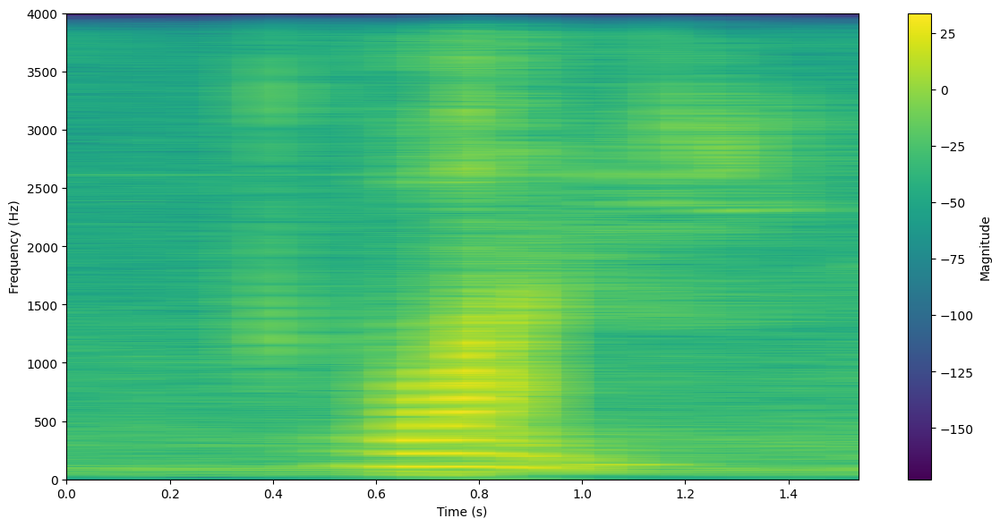

## 第二次编程作业

1. 语音录制：3个单词发音 one two six，建议用 8kHz 采样。

2. 代码编写：要求使用你自己编写的FFT代码，不能调用函数库。

3. 运行结果：

   - 画出语音波形图。
   
   - 画出不同窗口宽度（5ms、10ms、15ms）的语谱图。

4. 将核心代码和运行结果截图等一起编写到 word 中，要求有代码和运行结果的简单说明。

5. 文件名名规则：学号+姓名-语谱图.docx

## 实验结果

|     | 5ms | 10ms | 15ms |
| --- | --- | --- | --- |
| one | | | |
| two | | | |
| six | | | |
