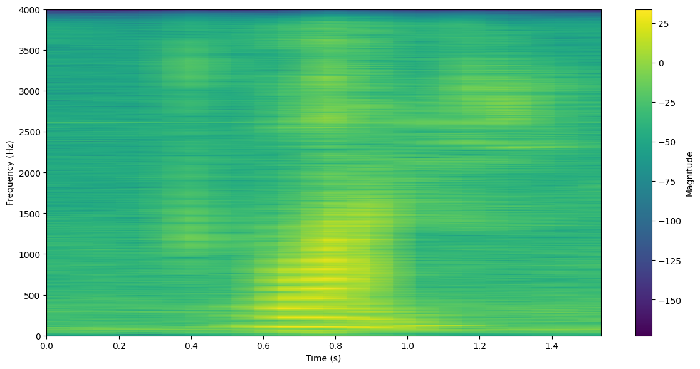

- [一、引言](#一引言)
- [二、预备知识](#二预备知识)
  - [（一）傅里叶变换](#一傅里叶变换)
    - [正交函数](#正交函数)
    - [正交函数集](#正交函数集)
    - [完备正交函数集](#完备正交函数集)
    - [三角函数集](#三角函数集)
    - [傅里叶级数](#傅里叶级数)
    - [傅里叶变换](#傅里叶变换)
    - [离散时间傅里叶变换](#离散时间傅里叶变换)
    - [离散傅里叶变换](#离散傅里叶变换)
  - [（二）快速傅里叶变换](#二快速傅里叶变换)
    - [DFT 与 FFT](#dft-与-fft)
    - [FFT 原理](#fft-原理)
  - [（三）短时傅里叶变换](#三短时傅里叶变换)
  - [（四）MFCC](#四mfcc)
  - [（五）语音活动检测](#五语音活动检测)
    - [短时过零率](#短时过零率)
    - [短时能量](#短时能量)
  - [（六）隐马尔科夫模型](#六隐马尔科夫模型)
    - [马尔可夫随机过程](#马尔可夫随机过程)
    - [马尔可夫链](#马尔可夫链)
    - [隐马尔科夫模型（HMM）](#隐马尔科夫模型hmm)
    - [Trellis 算法](#trellis-算法)
      - [前向算法](#前向算法)
      - [后向算法](#后向算法)
      - [维特比算法](#维特比算法)
    - [Baum-Welch 算法](#baum-welch-算法)
  - [（七）支撑向量机](#七支撑向量机)
    - [**支持向量机（Support Vector Machine, SVM）详解**](#支持向量机support-vector-machine-svm详解)
- [三、具体实践](#三具体实践)
  - [（一）数据处理](#一数据处理)
  - [（二）特征提取](#二特征提取)
  - [（三）模型训练](#三模型训练)
- [五、结论](#五结论)
- [六、附录](#六附录)

# 一、引言

孤立词语音识别（Isolated Word Speech Recognition）是语音识别中的一项基本任务，要求模型在得到输入的孤立词语音音频后，将其正确分类为对应的单词。

本次实验，我们希望对20个孤立词设计语音识别系统。

| 序号 | 00  | 01   | 02   | 03   | 04   | 05   | 06   | 07   | 08   | 09   |
|------|-----|------|------|------|------|------|------|------|------|------|
| 单词 | 数字 | 语音 | 语言 | 处理 | 中国 | 忠告 | 北京 | 背景 | 上海 | 商行 |

| 序号 | 10     | 11      | 12     | 13       | 14         | 15    | 16      | 17    | 18     | 19      |  
|------|--------|---------|--------|----------|------------|-------|---------|-------|--------|---------|  
| 单词 | Speech | Speaker | Signal | Sequence | Processing | Print | Project | File  | Open    | Close   |  

根据课程所学知识，我首先对语音样本抽取MFCC特征。为了减少模型复杂性和计算复杂度，我并未采用深度神经网络，而是采用隐马尔可夫模型和支撑向量机，分别实现语音识别，并分析它们的性能优缺点。

值得一提的是，本次实验所给出的语音样本大多质量不高，噪音过大，所以我在训练模型前，对各个样本做语音活动检测（Voice Activity Detection），筛选掉严重畸形的样本，从而保证训练数据集的干净。

# 二、预备知识

## （一）傅里叶变换

在介绍傅里叶变换之前，我们需要先回顾一下**正交函数**和**傅里叶级数**。

### 正交函数

正交函数与正交向量类似。我们可以**把函数看作是一个向量空间中的向量**：一个函数在时间轴上是一个向量，函数的值是这个向量的坐标。

我们考虑两个函数 $f_1(t)$ 和 $f_2(t)$ ，在时间区间 $[t_1, t_2]$ 上。

我们希望用 $f_2(t)$ 来近似表示 $f_1(t)$ ，即：

$$
f_1(t) \approx c_{12}f_2(t) \quad t_1 < t < t_2
$$

类似的，我们可以定义误差函数为：

$$
\epsilon(t) = f_1(t) - c_{12}f_2(t)
$$

为了使 $f_1(t)$ 和 $f_2(t)$ 之间的误差最小化，我们使用**均方误差**：

$$
\overline{\epsilon^2(t)} = \frac{1}{t_2 - t_1} \int_{t_1}^{t_2} \epsilon^2(t) dt = \frac{1}{t_2 - t_1} \int_{t_1}^{t_2} [f_1(t) - c_{12}f_2(t)]^2 dt
$$

我们对 $c_{12}$ 求导数并令其为零：

$$
\frac{d\overline{\epsilon^2(t)}}{dc_{12}} = 0 \implies c_{12} = \frac{\int_{t_1}^{t_2} f_1(t)f_2(t)dt}{\int_{t_1}^{t_2} f_2^2(t)dt}
$$

与正交向量类似，系数 $c_{12}$ 表征着两个函数 $f_1(t)$ 和 $f_2(t)$ 的相似程度，称为 $f_1(t)$ 和 $f_2(t)$ 的**相关系数**。

当 $c_{12} = 0$ 时，函数 $f_1(t)$ 和 $f_2(t)$ 是**正交**的。

所以，正交函数的严格定义如下：

在区间 $[t_1, t_2]$ 上，两个函数 $f_1(t)$ 和 $f_2(t)$ 是正交的，当且仅当：

$$
\int_{t_1}^{t_2} f_1(t)f_2(t)dt = 0
$$

这里我们也可以看出，正交函数与正交向量的相似。如果把时间轴看作一个连续的“基底”（类似于向量空间中的坐标轴），那么一个函数 $f(t)$ 可以被看作在这个“基底”上定义的一个向量。在每个时间点 $t$ 上，$f(t)$ 的值可以看作这个“向量”的一个分量。因为时间轴是连续的，这个“向量”的分量是无穷多的（对应于 $t$ 的每个可能取值），而不是有限个。

### 正交函数集

在区间 $[t_1, t_2]$ 上的 $n$ 个函数 $f_1(t)$、$f_2(t)$、$\cdots$、$f_n(t)$ 称为**正交函数集**，当且仅当：

$$
\left\{
\begin{aligned}
&\int_{t_1}^{t_2} f_i(t)f_j(t)dt = 0 \quad (i \neq j) \\
&\int_{t_1}^{t_2} f_i^2(t)dt = k_i \quad (i = 1, 2, \cdots, n)
\end{aligned}
\right.
$$

这里 $k_i \neq 0$ 是常数。

任意一个函数 $g(t)$ 在区间 $[t_1, t_2]$ 上都可以用 $n$ 个正交函数的**线性组合**来近似表示：

$$
g(t) \approx c_1f_1(t) + c_2f_2(t) + \cdots + c_nf_n(t)
$$

在均方误差最小的情况下，可求解系数 $c_i$ ：

$$
\left\{
\begin{aligned}
&\overline{\epsilon^2(t)} = \frac{1}{t_2 - t_1} \int_{t_1}^{t_2} [g(t) -\sum_{i=1}^nc_if_i(t)]^2 dt \\
&\frac{d\overline{\epsilon^2(t)}}{dc_i} = 0 \quad (i = 1, 2, \cdots, n)
\end{aligned}
\right.
$$

则系数 $c_i$ 为：

$$
c_i = \frac{\int_{t_1}^{t_2} g(t)f_i(t)dt}{\int_{t_1}^{t_2} f_i^2(t)dt} = \frac{1}{k_i}\int_{t_1}^{t_2} g(t)f_i(t)dt
$$
这里 $c_i$ 是函数 $g(t)$ 在正交函数集 $\{f_1(t), f_2(t), \cdots, f_n(t)\}$ 上的投影系数。

### 完备正交函数集

在区间 $[t_1, t_2]$ 上，正交函数集 $\{f_1(t), f_2(t), \cdots, f_n(t)\}$ 近似表示任意一个函数 $g(t)$，如果：

$$
\lim_{n \to \infty} \overline{\epsilon^2(t)} = 0
$$

则称 $\{f_1(t), f_2(t), \cdots, f_n(t)\}$ 为**完备正交函数集**。其中 $\overline{\epsilon^2(t)}$ 是均方误差。

所以，所谓**完备**是指对任意函数 $g(t)$ 都可以用一个无穷级数表示：

$$
g(t) = \sum_{i=1}^{\infty} c_if_i(t)
$$

这个级数收敛于 $g(t)$ ，上式也就是 $g(t)$ 的正交分解。

在实际应用中，我们通常只需要有限个正交函数就可以近似表示任意函数 $g(t)$。这就是正交分解的意义所在。

### 三角函数集

三角函数集是一个常用的完备正交函数集。

$$
\{cos(n\omega t) , \ sin(n\omega t) \mid n = 0, 1, 2, \cdots\}
$$

在区间 $[t_0, t_0 + T]$ 上，上述无限个三角函数组成一个完备正交函数集。这里 $T$ 是周期，$T=\frac{2\pi}{\omega}$ 。

### 傅里叶级数

傅里叶级数是一个重要的数学工具，它可以把一个**周期函数**表示为一组正弦和余弦函数的**线性组合**。

傅里叶级数的形式为：

$$
f(t) = \frac{a_0}{2} + \sum_{n=1}^{\infty} \left[ a_n \cos(n\omega t) + b_n \sin(n\omega t) \right]
$$

这里 $a_0$、$a_n$ 和 $b_n$ 是傅里叶系数，$\omega$ 是角频率。其中：

$$
\begin{aligned}
a_n &= \frac{2}{T} \int_{t_0}^{t_0 + T} f(t) \cos(n\omega t) \, dt \\
b_n &= \frac{2}{T} \int_{t_0}^{t_0 + T} f(t) \sin(n\omega t) \, dt
\end{aligned}
$$

---

根据欧拉公式：

$$
e^{j\theta} = \cos(\theta) + j\sin(\theta)
$$

我们可以把傅里叶级数写成**复数形式**：

$$
f(t) = \sum_{n=-\infty}^{\infty} F_n e^{jn\omega t}
$$

其中：

$$
F_n = \frac{1}{T} \int_{t_0}^{t_0 + T} f(t) e^{-jn\omega t} \, dt
$$

这里，复指数函数集 $\{e^{jn\omega t} \mid n = 0, \pm 1, \pm 2, \cdots\}$ 是一个完备正交函数集。我们就不加证明了。

### 傅里叶变换

傅里叶变换是一个重要的数学工具，它可以把一个**非周期函数**表示为一组正弦和余弦函数的**连续积分**。

对于一个周期信号 $f(t)$ ，设其周期为 $T$ ，则其角频率为 $\omega = \frac{2\pi}{T}$ ，此时 $f(t)$ 包含的频率分量为 $\omega$ 的整数倍，在频谱上表现为一个个离散的谱线。当 $T \to \infty$ 时，$\omega \to 0$ ，频率分量变为连续的，频谱上表现为一个个连续的谱线。同时，当 $T \to \infty$ 时，$f(t)$ 变为一个**非周期信号**。

$f(t)$ 的谱系数（即各个频率分量的系数）为：

$$
F(n\omega) = \frac{1}{T} \int_{t_0}^{t_0 + T} f(t) e^{-jn\omega t} \, dt 
$$

显然，当 $T \to \infty$ 时，$F(n\omega)$ 趋于 0 。所以，如果我们对非周期函数 $f(t)$ 进行傅里叶变换，能得到连续谱，但其幅度无限小。虽然各个频率分量的幅度无限小，但它们之间仍存在相对大小。所以我们引入**频谱密度函数**。

我们考虑：

$$
T F(n\omega) = \int_{t_0}^{t_0 + T} f(t) e^{-jn\omega t} \, dt
$$

而且，

$$
T F(n\omega) = \frac{F(n\omega)}{\frac{1}{T}} = \frac{F(n\omega)}{f}
$$

由此可见，$T F(n\omega)$ 表征着单位频带上的频谱值。因此我们可以把 $T F(n\omega)$ 看作是一个**频谱密度函数**，并记 $F(jn\omega) = T F(n\omega)$。

由傅里叶级数的定义，我们可以得到：

$$
\begin{aligned}
f(t) &= \sum_{n=-\infty}^{\infty} F(n\omega) e^{jn\omega t}\\
&= \sum_{n=-\infty}^{\infty} \frac{F(jn\omega)}{T} e^{jn\omega t}\\
\end{aligned}
$$

当 $T \to \infty$ 时，$\Delta(n\omega) = \omega \to d\omega$ ，$(n\omega) \to \omega$ ，所以：

$$
\begin{aligned}
\lim_{T \to \infty} f(t) &= \lim_{T \to \infty} \sum_{n=-\infty}^{\infty} F(jn\omega) \frac{\omega}{2\pi} e^{jn\omega t}\\
&= \frac{1}{2\pi} \int_{-\infty}^{\infty} F(j\omega) e^{j\omega t} d\omega\\
\end{aligned}
$$

至此，我们就推导出了**傅里叶变换**的公式：

$$
F(jw) = \int_{-\infty}^{\infty} f(t) e^{-j\omega t} dt
$$

**傅里叶逆变换**的公式为：

$$
f(t) = \frac{1}{2\pi} \int_{-\infty}^{\infty} F(j\omega) e^{j\omega t} d\omega
$$

$F(j\omega)$ 有时也简写为 $F(\omega)$ 。

由于 $f(t)$ 是实函数，所以 $F(\omega)$ 的虚部为零。

$$
\begin{aligned}
f(t) &= \frac{1}{2\pi} \int_{-\infty}^{\infty} F(\omega) e^{j\omega t} d\omega\\
&= \frac{1}{2\pi} \int_{-\infty}^{\infty} |F(\omega)| cos(\omega t + \phi(\omega)) d\omega + j \frac{1}{2\pi} \int_{-\infty}^{\infty} |F(\omega)| sin(\omega t + \phi(\omega)) d\omega\\
&= \frac{1}{2\pi} \int_{-\infty}^{\infty} |F(\omega)| cos(\omega t + \phi(\omega)) d\omega
\end{aligned}
$$

所以我们得到：

这表明：一个非周期信号 $f(t)$ 可以看作是无穷多个振幅无穷小的连续余弦信号之和。

### 离散时间傅里叶变换

上述考虑的是连续时间下的傅里叶变换。我们现在考虑**离散时间**下的傅里叶变换。

对于**非周期信号** $x(n)$ 的离散时间傅里叶变换（DTFT）为：

$$
X(e^{j\omega}) = \sum_{n=-\infty}^{\infty} x(n) e^{-j\omega n}
$$

这里 $X(e^{j\omega})$ 是一个复数函数，称为**频谱**。它是一个周期为 $2\pi$ 的周期函数。

离散时间傅里叶变换的**逆变换**为：

$$
x(n) = \frac{1}{2\pi} \int_{-\pi}^{\pi} X(e^{j\omega}) e^{j\omega n} d\omega
$$

### 离散傅里叶变换

当我们使用计算机进行数字信号处理时：

- 计算机只能处理有限个数据点。

- 计算机只能处理有限个频率分量。

所以，在实际应用中，我们一定是对**离散时间**，且**有限长度**的信号进行傅里叶变换。我们称之为**离散傅里叶变换**（DFT）。

需要先指出的是，离散傅里叶变换（DFT）是对离散时间傅里叶变换（DTFT）的一个近似。DFT 是对 DTFT 的一个有限采样。

DTFT 是一个连续的函数，而无限多个频率分量无法被计算机存储。而 DFT 是一个离散的函数。

DFT 的定义为：

1. 将有限长序列 $x(n)$ ，$n = 0, 1, \cdots, N - 1$ ，拓展成**周期函数** $\tilde{x}(n)$ 。

$$
\tilde{x}(n) = \sum_{r=-\infty}^{\infty} x(n+rN) = x((n))_{N}\ , \quad ((n))_{N} = n \mod N
$$

2. 计算 DFT：

$$
\begin{aligned}
X[k] &= \sum_{n=0}^{N-1} x(n) e^{-j\frac{2\pi}{N}nk} \quad (k = 0, 1, \cdots, N - 1)\\
&= \sum_{n=0}^{N-1} x(n) W_N^{nk} \quad (W_N = e^{-j\frac{2\pi}{N}}\ \text{为N阶单位根})
\end{aligned}
$$

3. 计算 IDFT：

$$
\begin{aligned}
x(n) &= \frac{1}{N} \sum_{k=0}^{N-1} X[k] e^{j\frac{2\pi}{N}nk} \quad (n = 0, 1, \cdots, N - 1)\\
&= \frac{1}{N} \sum_{k=0}^{N-1} X[k] W_N^{-nk}
\end{aligned}
$$

---

## （二）快速傅里叶变换

### DFT 与 FFT

在实际的信号处理中，我们都采用**离散傅里叶变换**（DFT）来对信号进行处理。

$$
X(k) = DFT[x(n)] = \sum_{n=0}^{N-1} x(n) W_N^{nk} \quad 0 \leq k \leq N-1
$$

计算每个 $X(k)$ 需要 $N$ 次乘法和 $N-1$ 次加法，而完成整个 DFT 需要 $N^2$ 次乘法和 $N(N-1)$ 次加法。DFT 的时间复杂度为 $O(N^2)$ ，对于大规模的信号处理，这个计算量是不可接受的。

因此，我们需要一种更高效的算法来计算 DFT。**快速傅里叶变换**（FFT）就是为了解决这个问题而提出的。

FFT 本质是一种分治算法。FFT 利用旋转因子 $W_N^{nk}$ （也就是 $N$ 阶单位根）的性质，避免重复计算，将 DFT 的计算复杂度降低到 $O(N \log N)$ 。FFT 算法的基本思想是将一个长度为 $N$ 的序列分解成两个长度为 $\frac{N}{2}$ 的子序列，然后递归地计算这两个子序列的 DFT，最后将结果合并起来。

### FFT 原理

为了简单起见，我们只考虑长度为 $N=2^m$ 的序列。

$$
\begin{aligned}
X(k) &= \sum_{n=0}^{N-1} x(n) W_N^{nk} \quad 0 \leq k \leq N-1\\
&= \sum_{n=0}^{N/2-1} x(2n) W_N^{2nk} + \sum_{n=0}^{N/2-1} x(2n+1) W_N^{(2n+1)k}\\
&= \sum_{n=0}^{N/2-1} g(n) \left(W_N^{2}\right)^{nk} + \sum_{n=0}^{N/2-1} h(n) \left(W_N^{2}\right)^{nk} W_N^k\\
&= \sum_{n=0}^{N/2-1} g(n) W_{N/2}^{nk} + W_N^k \sum_{n=0}^{N/2-1} h(n) W_{N/2}^{nk}\\
&= G(k) + W_N^k H(k) \quad (0 \leq k \leq N/2-1)
\end{aligned}
$$

其中 $g(n) = x(2n)$ 和 $h(n) = x(2n+1)$ 分别是偶序列和奇序列。

但注意到上述推导中 $k$ 的范围是 $0 \leq k \leq N-1$，而我们只计算了 $0 \leq k \leq \frac{N}{2}-1$ 的情况。

当 $\frac{N}{2} \leq k \leq N-1$，我们可以利用单位根的对称性：

$$
\begin{aligned}
X(k+N/2) &= \sum_{n=0}^{N/2-1} g(n) W_{N}^{2n(k+N/2)} + \sum_{n=0}^{N/2-1} h(n) W_{N}^{(2n+1)(k+N/2)}\\
&= \sum_{n=0}^{N/2-1} g(n) W_{N}^{2nk} \cdot W_{N}^{Nn} + W_{N}^{\frac{(2n+1)N}{2}} \sum_{n=0}^{N/2-1} h(n) W_{N}^{(2n+1)k}\\
&= \sum_{n=0}^{N/2-1} g(n) W_{N}^{2nk} + (-1) \sum_{n=0}^{N/2-1} h(n) W_{N}^{(2n+1)k}\\
&= G(k) - W_N^k H(k), \quad (0 \leq k \leq N/2-1)
\end{aligned}
$$

综上，我们可以得到：全部 $N$ 个点的离散傅里叶变换。

$$
\begin{aligned}
& X(k) = G(k) + W_N^k H(k)\\
& X(k+N/2) = G(k) - W_N^k H(k)\\
&\text{其中} \quad 0 \leq k \leq N/2-1
\end{aligned}
$$

所以，我们可以将一个 N 点的 DFT 分解成两个 $\frac{N}{2}$ 点的 DFT，递归地计算这两个 DFT，最后将结果合并起来。

---

## （三）短时傅里叶变换

短时傅里叶变换（Short-Time Fourier Transform, STFT）是傅里叶变换（FT）的扩展，用于分析**非平稳信号**（如音频、振动信号等）。通过将信号分成短时重叠的窗口，在每个窗口内进行傅里叶变换，得到信号的**时频联合表示**。

对信号 $x(t)$ ，STFT 的表达式为：

$$
X(t, f) = \int_{-\infty}^{\infty} x(\tau) \cdot w(\tau - t) \cdot e^{-j 2\pi f \tau} \, d\tau
$$

其中：

- $w(\tau - t)$ 是窗函数（如汉明窗、汉宁窗），在时间 $t$ 附近截取信号。

- $X(t, f)$ 表示时间 $t$ 和频率 $f$ 处的频谱分量。

**窗口长度**决定时间分辨率和频率分辨率的权衡：窗口越长，频率分辨率越高，时间分辨率越低。

**重叠率**（Overlap）通常为 50%~75%，以减少截断效应。

---

## （四）MFCC

梅尔频率倒谱系数（Mel-Frequency Cepstral Coefficients, MFCC）​是语音信号处理中广泛使用的特征提取方法，模拟人耳对频率的非线性感知（Mel刻度）。

对人耳的听觉机理的研究发现，人耳对不同频率的声波有不同的听觉敏感度，而且从 200Hz 到 5kHz 的语音信号对语音的清晰度影响较大。当两个响度不同的声音作用于人耳时，响度较高的频率成分会影响到人耳对响度较低的频率成分的感受，使其变得不易察觉，这种关系现象被称为**掩蔽效应**。

由于频率较低的声音在耳蜗基底膜上行波传递的速度大于频率较高的声音，故而低音容易掩蔽高音，而高音较难掩蔽低音，所以在低频处的声音掩蔽的临界带宽较高频要小。

根据以上原理，人们从低频到高频的频带内按临界带宽由密到疏设计了一组带通滤波器，在 Mel 刻度上均匀分布，对输入信号进行滤波。将每个带通滤波器输出的信号能量作为信号的基本特征，并对此特征进行进一步处理就可以作为语音信号的特征。MFCC 特征即将上述特征在梅尔标度频率域进行离散余弦变换得到的倒谱参数。

---

## （五）语音活动检测

语音活动检测（VAD）用于自动识别音频信号中的语音段和非语音段（静音/噪声），是语音处理中的关键预处理步骤。

VAD通过分析音频的时域、频域或能量特征，判断当前帧是否为语音：

- **语音段**：通常具有较高的能量、清晰的谐波结构、特定的频谱特性。

- **非语音段**：低能量（静音）或宽带噪声（如键盘敲击声）。

### 短时过零率

短时过零率是语音信号处理中的基础时域特征，用于衡量信号在短时间内穿过零点的频率。

对离散信号 $x[n]$ ，第 $m$ 帧的过零率计算为： 
 
$$
ZCR_m = \frac{1}{2} \sum_{n=1}^{N} |\text{sgn}(x[n]) - \text{sgn}(x[n-1])|
$$

其中：

- $\text{sgn}$ 为符号函数（正数 = 1，负数 = -1）。

- $N$ 为帧长（如10ms对应160采样点 @16kHz）。

| **信号类型**     | **ZCR范围**       | **典型场景**              |
|-----------------|------------------|--------------------------|
| 浊音（Voiced）   | 低（如0.1~0.3）   | 元音（/a/、/i/）           |
| 清音（Unvoiced） | 高（如0.4~0.8）   | 辅音（/s/、/f/）           |
| 静音/噪声        | 中等（依赖噪声）   | 白噪声可能接近0.5           |

### 短时能量

短时能量是语音信号处理中最基础的**时域特征**之一，用于衡量信号在短时间窗口内的能量强度。

对离散信号 $x[n]$ ，第 $m$ 帧的短时能量计算为：

$$
E_m = \sum_{n=m}^{m+N-1} x^2[n]
$$

其中：
- $N$ 为帧长（如20ms对应320采样点 @16kHz）

- 实际应用中常使用**平方根版本**（RMS）避免数值过大：

  $$
  E_{\text{RMS}} = \sqrt{\frac{1}{N} \sum_{n=m}^{m+N-1} x^2[n]}
  $$

| **信号类型** | **短时能量特点**          | **典型场景**                 |
|-------------|-------------------------|-----------------------------|
| **语音段**   | 能量较高且波动明显         | 元音（/a/、/i/）能量 > 清音   |
| **清音**     | 能量较低但高于背景噪声     | 辅音（/s/、/f/）             |
| **静音/噪声** | 能量低且平稳              | 无语音时的环境噪声           |

---

## （六）隐马尔科夫模型

### 马尔可夫随机过程

设 $\{X_t, t \in T\}$ 是随机过程，若对任意的正整数 $n$ 和 $t_1 < t_2 < \cdots < t_n \in T$ ，$P\{X_{t_1}=x_1, \cdots, X_{t_{n-1}}=x_{n-1}\}$ ，且满足：

$$
P\{X_{t_n}=x_n | X_{t_1}=x_1, \cdots, X_{t_{n-1}}=x_{n-1}\} = P\{X_{t_n}=x_n | X_{t_{n-1}}=x_{n-1}\}
$$

则称 $\{X_t\}$ 是一个**马尔可夫过程**，即未来状态只与当前状态有关，而与过去状态无关（无记忆性）。

### 马尔可夫链

马尔科夫链是**离散时间、离散状态**的马尔可夫过程。

其数学定义如下：

随机序列 $X_t$ ，在任意时刻 $t$ ，$X_t$ 可以处于状态 $\theta_1, \cdots, \theta_N$ ，且在任意 $t+k$ 时刻（$\forall k > 0$），$X_t$ 所处的状态为 $q_{t+k}$ 的概率只与 $X_t$ 的状态有关，而与 $t$ 时刻之前的状态无关。

也即是：

$$
P\{X_{t+k} = q_{t+k} | X_t = q_t, X_{t-1} = q_{t-1}, \cdots, X_1 = q_1\} = P\{X_{t+k} = q_{t+k} | X_t = q_t\}
$$

其中，$q_1, q_2, \cdots, q_t, q_{t+k} \in \{\theta_1, \theta_2, \cdots, \theta_N\}$。

对于马尔科夫链，我们通常使用**转移矩阵**来描述状态之间的转移概率。

我们定义 $P_{ij}$ 为从状态 $i$ 转移到状态 $j$ 的概率。

则我们可以定义 k 步转移概率为：

$$
P_{ij}(t, t+k) = P\{X_{t+k} = \theta_j | X_t = \theta_i\}, \quad i,j \in [1,N], t \in T
$$

上式表示：已知当在时刻 $t$ 时，系统处于状态 $\theta_i$，经过 $k$ 步后，系统转移到状态 $\theta_j$ 的概率。

当 $P_{ij}(t, t+k)$ 与 $t$ 无关时，称为**齐次马尔科夫链**。此时我们简记为：

$$
P_{ij}(t, t+k) = P_{ij}(k)
$$

当 $k=1$ 时，称为**一步转移概率**，进一步简记为 $P_{ij}$ 。

一步转移概率 $P_{ij}$ 组成的矩阵称为**转移矩阵**，记为 $A$ 。

显然多步转移概率可以通过转移矩阵的幂来计算：

$$
\text{k 步转移矩阵} = A^k
$$

显然，转移矩阵很大程度上描述一个马尔科夫链，但是仅靠 $P_{ij}$ 决定不了马尔科夫链的初始状态。即：通过转移矩阵 $A$ ，我们求不出概率 $P(q_1=\theta_i)$ 。

为了完整地描述马尔科夫链，我们引入**初始状态分布** $\Pi$ ：

$$
\pi_i = P(q_1 = \theta_i), \quad i \in [1,N]
$$

其中 $\sum_{i=1}^N \pi_i = 1$。

### 隐马尔科夫模型（HMM）

在实际中，我们遇到地问题往往比马尔科夫链所描述的更复杂，观察到的事件不一定是与状态一一对应的，而是通过一组概率分布相联系，这样的模型称为**隐马尔科夫模型（HMM）**。它是一个双重随机过程，其中之一是马尔科夫链，描述状态转移；另一个随机过程则描述状态和观察值之间之间统计对应关系。

在观察者角度，只能看到观察值，不能直接看到状态（即不同于马尔科夫链），因而称之为“隐”马尔科夫模型。

---

我们举一个“球和缸”的例子来说明 HMM 的概念。

- 设$N$个缸，每个缸中装有彩球，总共有 $M$ 种不同颜色，每个缸内不同颜色的球的多少由一组概率分布来描述。

- 根据某个初始概率分布，随机选择一个缸 $i$ ，再根据这个缸中彩色球颜色的概率分布，随机选一个球，记 $O_1$ ,再把球放回缸中。

- 根据缸的转移概率，选择下一个缸 $j$ （观测者不知道更换了缸），再根据这个缸中彩色球颜色的概率分布，随机选择一个球，记 $O_2$ ,再把球放回缸中。

- 最后，得到描述球颜色的序列 $O_1, O_2, O_3, O_4 \cdots$ ，即为观察值序列，但每次选取的缸和缸之间的转移并不能直接观察。

在这个例子中，观察者看到的只是球的颜色序列，而缸的状态是不可见的（隐状态）。而构建 HMM 的目的是通过观察到的球的颜色序列来推测幕后的缸序列。

---

我们可以将 HMM 定义为一个**五元组**：$ (Q, V, A, B, \pi) $ ，其中：

- $Q$ 是状态集合，$Q = \{\theta_1, \theta_2, \cdots, \theta_N\}$ 。

- $V$ 是观测值集合，$V = \{v_1, v_2, \cdots, v_M\}$ 。

- $A$ 是状态转移概率矩阵，$A = [a_{ij}]$ ，其中 $a_{ij} = P\{q_{t+1}=\theta_j | q_t=\theta_i\}$ 。

- $B$ 是观测概率矩阵，$B = [b_{ij}]$ ，其中 $b_{ij} = b_i(j) = P\{O_t=v_j | q_t=\theta_i\}$ 表示在状态 $\theta_i$ 时，观测到 $v_j$ 的概率。

- $\Pi$ 是初始状态概率分布，$\Pi = [\pi_1, \pi_2, \cdots, \pi_N]$ ，其中 $\pi_i = P\{q_1=\theta_i\}$ 。

---

隐马尔科夫模型（HMM）的主要任务是解决以下三个问题：

1. **评估问题（Evaluation）**：给定模型 $\lambda = (A, B, \pi)$ 和观测序列 $O$ ，计算 $P(O \mid \lambda)$ 。
   
   - **解决方法**：前向算法（Forward Algorithm）或后向算法（Backward Algorithm）。

2. **解码问题（Decoding）**：给定模型 $\lambda$ 和观测序列 $O$ ，找到最可能的状态序列 $Q$ 。

   - **解决方法**：维特比算法（Viterbi Algorithm）。

3. **学习问题（Learning）**：给定观测序列 $O$ ，估计模型参数 $\lambda$ 。

   - **解决方法**：鲍姆-韦尔奇算法（Baum-Welch Algorithm），即 EM 算法在 HMM 中的应用。

### Trellis 算法

格栅（Trellis）算法是一种用于处理 HMM 的高效算法，主要用于评估问题和解码问题。它通过构建一个网格结构（Trellis）来表示状态转移和观测序列的关系。

Trellis 算法包含以下几个主要部分：

- **前向算法**：用于计算给定模型参数时，观测序列出现的概率。

- **后向算法**：用于计算从某个状态开始到结束的观测序列的概率。

#### 前向算法

1. **作用**：计算给定模型参数 $\lambda$ 时，观测序列 $O$ 出现的概率 $P(O|\lambda)$ 。  
    
2. **核心思想**：

    - 构建一个 $T \times N$ 的格栅（$T$ 为时间步，$N$ 为状态数）。

    - 每个节点 $\alpha(t,i)$ 表示：在时间 $t$ 处于状态 $i$ 并观测到 $o_1,o_2,...,o_t$ 的概率。  

3. **递推公式**：  
$$
\alpha(t,j) = \left[ \sum_{i=1}^N \alpha(t-1, i) \cdot a_{ij} \right] \cdot b_j(o_t)
$$

#### 后向算法

1. **作用**：计算从时间 $t$ 到结束的观测概率 $P(o_{t+1},...,o_T | s_t=\theta_i)$ ，记为 $\beta_t(i)$ 。  

2. **递推公式**：

$$
\beta_t(i) = \sum_{j=1}^N a_{ij} \cdot b_j(o_{t+1}) \cdot \beta_{t+1}(j)
$$

3. **用途**：与前向算法结合用于参数学习（Baum-Welch算法）。

#### 维特比算法

1. **作用**：找到最可能生成观测序列 $O$ 的隐藏状态序列 $Q^*$ 。

2. **关键改进**：

    - 用**最大值**替代前向算法中的**求和**，并记录路径回溯指针。

### Baum-Welch 算法

Baum-Welch 算法是 HMM 的**无监督学习算法**，用于在仅知道观测序列的情况下，估计模型参数（转移矩阵、发射矩阵、初始状态分布）。它是**期望最大化（EM）算法**在 HMM 中的具体实现。

给定观察值序列 $O$ ，我们希望确定一个模型 参数 $\lambda = (A, B, \Pi)$ ，使得 $P(O|\lambda)$ 最大。

$$
P(O|\lambda) = \sum_{Q} P(O, Q|\lambda) = \sum_{Q} P(O|Q, \lambda) P(Q|\lambda)
$$

其中 $Q$ 是所有可能的隐藏状态序列。由于直接计算 $P(O\mid\lambda)$ 涉及对所有可能的 $Q$ 求和，计算复杂度 $O(N^T)$ ，不可行，Baum-Welch 算法通过 ​EM 框架间接优化它。

EM 算法保证：（假设 $\lambda^{(t)}$ 是第 $t$ 次迭代的参数）

$$
P(O|\lambda^{(t+1)}) \ge P(O|\lambda^{(t)}) \iff log P(O|\lambda^{(t+1)}) \ge log P(O|\lambda^{(t)})
$$

Baum-Welch 算法通过以下两步迭代优化参数：

1. **E步（Expectation）**：基于当前参数计算隐藏状态的期望统计量（利用前向-后向算法）。

2. **M步（Maximization）**：用期望统计量更新模型参数，最大化观测序列的似然（即最大化 $P(O|\lambda)$ ）。

---

## （七）支撑向量机

### **支持向量机（Support Vector Machine, SVM）详解**

支持向量机是一种经典的**监督学习**算法，广泛应用于分类和回归任务，尤其擅长解决**小样本、高维度、非线性可分**问题。

SVM 的核心思想：

- **分类目标**：找到一个最优超平面（决策边界），最大化两类数据之间的间隔（Margin）。

- **关键点**：仅依赖**支持向量**（距离超平面最近的样本点）决定模型，对异常值鲁棒。

SVM 的算法流程：

1. **输入**：训练数据 $\{(x_i, y_i)\}_{i=1}^n$ ，标签 $y_i \in \{-1, +1\}$ 。

2. **求解优化问题**：获得 $\alpha_i$ 和 $b$ 。

3. **预测**：对新样本 $x$ ：  
   $$
   f(x) = \text{sgn}\left( \sum_{i=1}^n \alpha_i y_i K(x_i, x) + b \right) 
   $$

# 三、具体实践

## （一）数据处理

本次实验的数据集由选修《数字信号处理》课程同学对二十个孤立单词录音，但由于部分同学录音时噪声较大，或者录音过急导致信号不完整，无法充当有效数据。在剔除该类数据后，共得到 2398 条有效数据，笔者将剩余的数据集随机划分为训练集与验证集，其中，训练集 1598 条数据，验证集 400 条数据，测试集 400 条数据。

1. 语音活动检测
 
我结合了短时能量、过零率和静音持续时间等多种特征，采用双门限法进行鲁棒的语音端点检测，能够有效区分语音与非语音区域，为了后续特征提取提供便利。

首先，将原始音频信号分帧，对每一帧分别计算短时能量和短时过零率。短时能量反映了信号的强度，过零率反映了信号的频率特性。

- 能量高、过零率低通常对应元音等语音段；

- 能量低、过零率高通常对应静音或无声段。

其次，我采用**双门限法判决**，即采用高低两个能量阈值（high/low threshold）和一个过零率阈值。

- 当帧的能量高于高阈值时，判定为语音段开始；

- 当帧的能量低于低阈值且过零率高于阈值时，判定为语音段结束；

- 语音段的起止点会根据阈值进行微调，避免因短暂噪声或停顿导致误判。

此外，我还采用了**静音持续时间过滤**。为了避免短暂的静音或噪声导致语音段被错误分割，算法会统计连续静音帧的数量，只有当静音持续时间超过设定阈值时，才认为语音段结束。

## （二）特征提取

我针对输入的语音数据，手动编写代码提取了每个数据的 13 维 MFCC 特征，并在后续分类过程中直接利用该特征进行分类。

预加重
首先对原始语音信号进行预加重处理，以提升高频成分，增强语音信号的高频特征，抑制低频噪声。

分帧与加窗
将预加重后的信号按固定长度进行分帧，并对每一帧加窗（如汉宁窗），以减少帧间信号的不连续性和频谱泄漏。

短时傅里叶变换（STFT）
对每一帧信号进行快速傅里叶变换（FFT），获得每帧的频谱信息。

功率谱计算
计算每帧的功率谱，反映信号在各个频率上的能量分布。

Mel滤波器组处理
将功率谱通过一组在Mel刻度上均匀分布的三角形滤波器组，模拟人耳对不同频率的感知特性，得到Mel频率能量谱。

对数运算
对Mel能量谱取对数，进一步压缩动态范围，增强对低能量成分的分辨能力。

离散余弦变换（DCT）
对对数Mel能量谱进行离散余弦变换，获得MFCC系数。通常只保留前若干（如13个）系数作为最终的特征向量。

## （三）模型训练

本实验采用隐马尔可夫模型（HMM）进行孤立词语音识别，模型训练的核心流程如下：

特征准备
首先对每个语音样本进行端点检测和MFCC特征提取，得到每个样本的时序特征序列。所有样本根据类别标签进行整理。

类别建模
针对每个类别（单词），分别训练一个独立的GMM-HMM模型。每个模型包含若干隐藏状态，每个状态用高斯混合分布建模观测概率，能够有效拟合语音特征的时序和分布特性。

训练数据拼接
对于每个类别，将该类别下所有样本的特征序列在时间维度上拼接为一个大样本，并记录每个样本的长度，便于HMM分段处理。

参数估计
利用Baum-Welch算法（EM算法）对每个类别的HMM参数进行最大似然估计，自动学习状态转移概率、观测概率分布等参数。

模型保存与评估
训练完成后，将所有类别的HMM模型保存。通过对测试集样本分别计算在各类别模型下的对数似然值，选择最大者作为识别结果，并统计整体识别准确率和混淆矩阵，评估模型性能。

该流程能够充分利用语音信号的时序特性和统计特性，实现对孤立词的高效识别。

# 五、结论

# 六、附录

